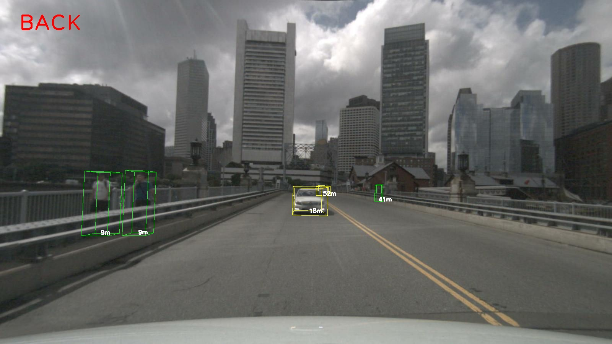

# NuScenes 单张图像可视化

此项目提供了一套使用Python加载和可视化NuScenes数据集的工具。主要功能包括加载图像、投影3D对象到2D图像、显示注释信息等。



**主要在于可以通过输入一张图片的名字，获取其ID，并将投影后的图片绘制保存。**

## 功能简介

- 加载NuScenes数据集中的图像
- 提取3D对象信息并转换到相机坐标系
- 将3D对象投影到2D图像上
- 在图像上绘制3D包围盒和深度信息
- 通过输入图像文件名获取对应ID并保存绘制后的图片

## 环境准备

在开始之前，请确保您的Python环境中安装了必要的库。您可以使用以下命令进行安装：

`pip install nuscenes-devkit opencv-python-headless pyquaternion pyyaml`

## 使用方法

配置路径：

在项目根目录下创建一个名为 `config.yaml` 的文件，内容如下：

`nuscenes_path: "/path/to/your/nuscenes/data"  # 设置NuScenes数据集的路径`
`image_filename: "path_to_sample_image"  # 设置需要可视化的样本图像`
`camera_channel: "CAM_FRONT"  # 设置相机通道，如CAM_FRONT, CAM_BACK等`

运行脚本：

`python visualize.py`

脚本将加载指定的样本图像并在图像上绘制3D对象的投影和注释信息，然后保存绘制后的图片。

## 项目结构

- `visualize.py`：主脚本，包含加载和可视化NuScenes数据集的主要功能。
- `config.yaml`：配置文件，用于设置NuScenes数据集路径和图像文件名。
- `README.md`：项目说明文档。
- `v1.0-mini`：存放数据集的地方

v1.0-mini
├── maps
├── samples
└── sweeps

## 主要代码段解释

### 初始化NuScenes数据集

```python
from nuscenes.nuscenes import NuScenes

class nuscence_visualize:
    def __init__(self, nuscenes_path: str):
        self.nusc = NuScenes(version='v1.0-mini', dataroot=nuscenes_path)
```

### 获取3D对象信息

```python
def get_obj3d_from_annotation(self, ann, ego_data, calib_data):
```

### 投影3D对象到2D图像

```python
def project_obj2image(self, obj3d_list, intrinsic):
```

### 在图像上绘制注释信息

```
def plot_annotation_info_camera_only(self, camera_img, obj_list):
```

### 可视化单个样本并保存结果

```python
def visualize_one_sample_single(self, sample, camera_name='CAM_FRONT', results=None, visible_level=1, scale_ratio=1, save_dir=None):
    # 获取图像数据
    sample_data = self.nusc.get('sample_data', sample['data'][camera_name])
    img_path = sample_data['filename']
    img = cv2.imread(img_path)
    
    # 获取注释信息并投影到图像
    # 省略详细代码...
    
    # 绘制投影结果
    img_with_annotations = self.plot_annotation_info_camera_only(img, obj_list)
    
    # 保存绘制后的图片
    if save_dir:
        save_path = os.path.join(save_dir, f"{sample_data['token']}.png")
        cv2.imwrite(save_path, img_with_annotations)
```

### 主函数

```
if __name__ == '__main__':
    import yaml

    with open('config.yaml', 'r', encoding='utf-8') as file:
        config = yaml.safe_load(file)

    nuscenes_path = config['nuscenes_path']
    image_filename = config['image_filename']
    camera_channel = config['camera_channel']

    nuscene = nuscence_visualize(nuscenes_path=nuscenes_path)
    sample = nuscene.nusc.get('sample', image_filename)
    nuscene.visualize_one_sample_single(sample, camera_channel, save_dir='output')

```

## 贡献

欢迎任何形式的贡献！